# 🔐 AWS Serverless File Approval System

<p align="center">


</p>

---

## 📌 Project Overview

The **AWS Serverless File Approval System** is a secure serverless web application that allows users to upload files and provides administrators with a dashboard to review, approve, or reject uploaded files.

The system is built entirely using managed AWS services without using EC2 servers.

The application uses **Amazon Cognito** for authentication and role-based authorization, **Amazon S3** for file storage, **API Gateway + AWS Lambda** for the backend, **DynamoDB** for file metadata, and **Amazon SNS** for administrator notifications.

---

## 🎯 Project Objectives

The main objectives of this project are:

- 🔐 Secure user authentication using Amazon Cognito
- 👥 Role-based access control using Cognito Groups
- 📤 Secure file uploads using S3 Presigned URLs
- 🗂️ Store uploaded files in a private S3 bucket
- 📝 Store file metadata in DynamoDB
- 👨‍💼 Provide an Admin Dashboard
- ✅ Allow administrators to approve files
- ❌ Allow administrators to reject files
- 📧 Notify administrators when a new file is uploaded
- ☁️ Host the frontend using Amazon S3 and CloudFront
- 🔒 Apply AWS security best practices
- 💰 Use a serverless architecture with no EC2 instances

---

### 📸 Architecture Diagram

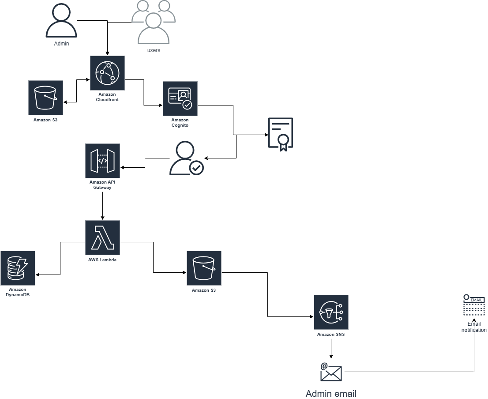

---

# ☁️ AWS Services Used

| AWS Service       | Purpose                                   |
| ----------------- | ----------------------------------------- |
| Amazon S3         | Frontend hosting and private file storage |
| Amazon CloudFront | CDN and HTTPS delivery                    |
| Amazon Cognito    | Authentication and user groups            |
| API Gateway       | REST API                                  |
| AWS Lambda        | Serverless backend                        |
| Amazon DynamoDB   | File metadata and approval status         |
| Amazon SNS        | Admin email notifications                 |
| AWS IAM           | Least-privilege permissions               |
| Amazon CloudWatch | Lambda logs and monitoring                |

---

# 📁 Project Structure

```text
AWS-Serverless-File-Approval-System/
│
├── frontend/
│   ├── index.html
│   ├── login.html
│   ├── register.html
│   ├── user.html
│   ├── admin.html
│   │
│   ├── css/
│   │   └── style.css
│   │
│   └── js/
│       ├── config.js
│       └── app.js
│
├── lambda/
│   └──lambda_function.py
│
├── images/
│       ├── arch.png
│       ├── cognito-user-pool.png
│       ├── cognito-groups.png
│       ├── s3-frontend.png
│       ├── s3-file-storage.png
│       ├── dynamodb-table.png
│       ├── sns-topic.png
│       ├── iam-role.png
│       ├── lambda.png
│       ├── api-gateway.png
│       ├── cloudfront.png
│       ├── user-dashboard.png
│       ├── admin-dashboard.png
│       └── testing.png
│
└── README.md
```

---

# 🚀 Step-by-Step Implementation

# Step 1 — Create the Frontend S3 Bucket

The first step is creating an S3 bucket to store the application's frontend files.

The bucket contains:

```text
index.html
login.html
register.html
user.html
admin.html
css/
js/
```

### Configuration

- Bucket name: `YOUR-FRONTEND-BUCKET`
- Object Ownership: Bucket owner enforced
- ACLs: Disabled
- Public Access: Blocked

The frontend bucket is accessed through CloudFront using **Origin Access Control (OAC)**.

### Screenshot

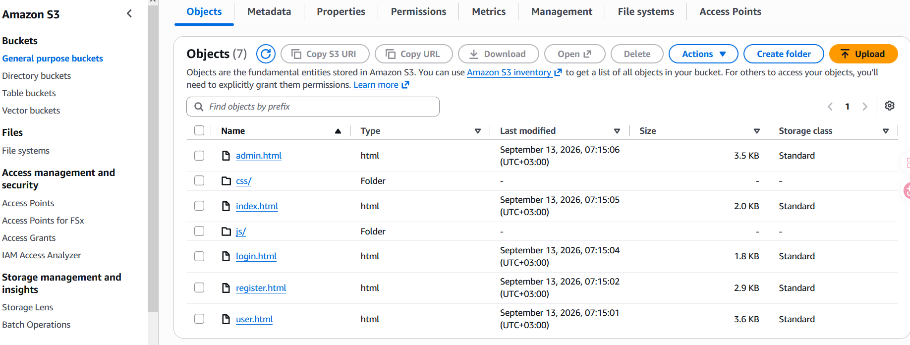

---

# Step 2 — Create the Private S3 File Storage Bucket

A separate S3 bucket is used to store uploaded files.

### Security Configuration

- Block all public access: Enabled
- ACLs: Disabled
- Bucket owner enforced
- Versioning: Enabled
- Server-side encryption: Enabled

Files are organized into:

```text
pending/
└── userId/
    └── fileId/
        └── fileName

approved/
└── userId/
    └── fileId/
        └── fileName
```

### 📸 Screenshot

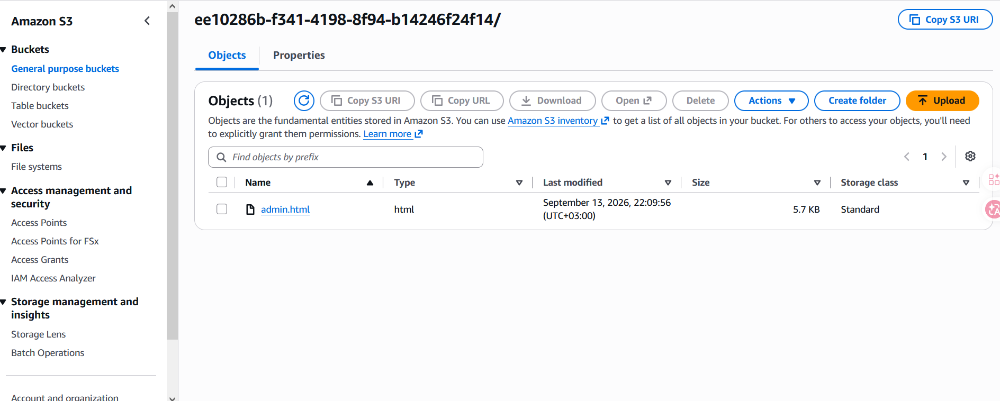
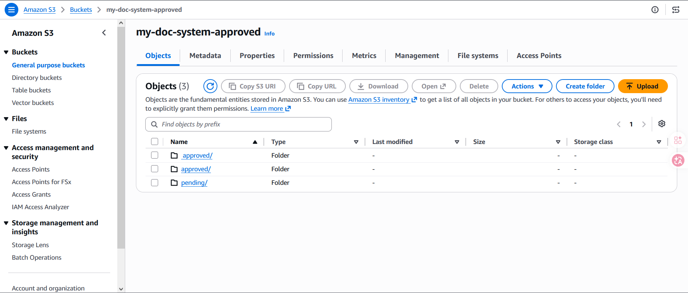

---

# Step 3 — Create Amazon Cognito User Pool

Amazon Cognito is used to provide secure authentication.

### User Pool

```text
FileApprovalSystemUsers
```

### Configuration

- Sign-in option: Email
- Username: Disabled
- MFA: Disabled for this prototype
- Account recovery: Email
- Required attribute: Email
- Default Cognito email provider

### 📸 Screenshot

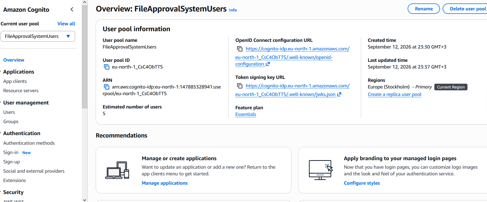

---

# Step 4 — Create Cognito Groups

Two groups are created for role-based access control:

```text
Users
Admins
```

### Users Group

Normal users can:

- Login
- Upload files
- Track upload status

### Admins Group

Administrators can:

- Access the Admin Dashboard
- View pending files
- Approve files
- Reject files

### 📸 Screenshot

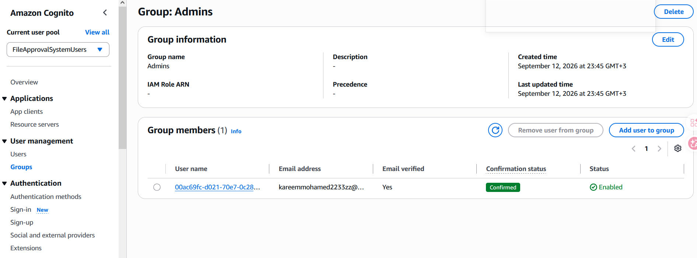
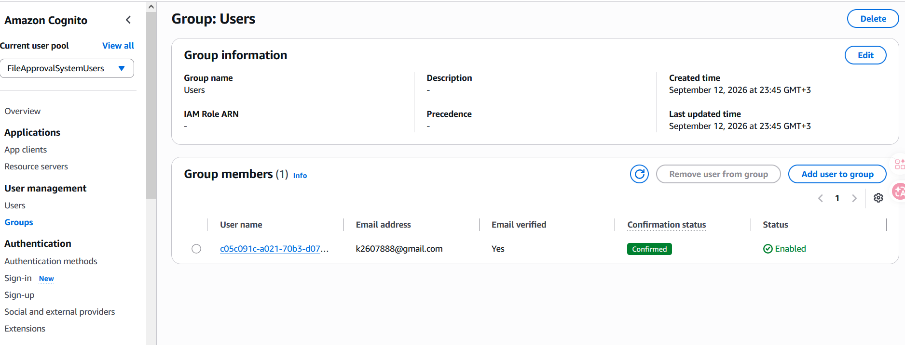

---

# Step 5 — Create Cognito App Client

An App Client is created for the web application.

```text
FileApprovalWebApp
```

Because this is a browser-based application:

```text
Client Secret = Disabled
```

The frontend uses the Client ID to communicate with Cognito.

### 📸 Screenshot

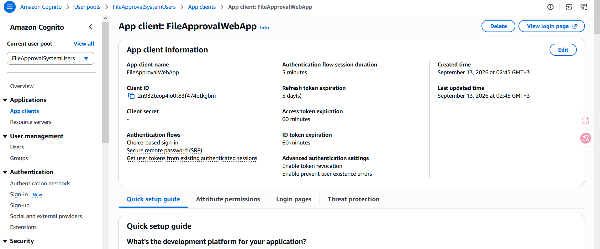

---

# Step 6 — Create Test Users

Two test accounts are used.

### Normal User

```text
Group: Users
```

### Administrator

```text
Group: Admins
```

The user's group membership is included in the Cognito JWT.

Example:

```json
{
  "cognito:groups": ["Admins"]
}
```

### 📸 Screenshot

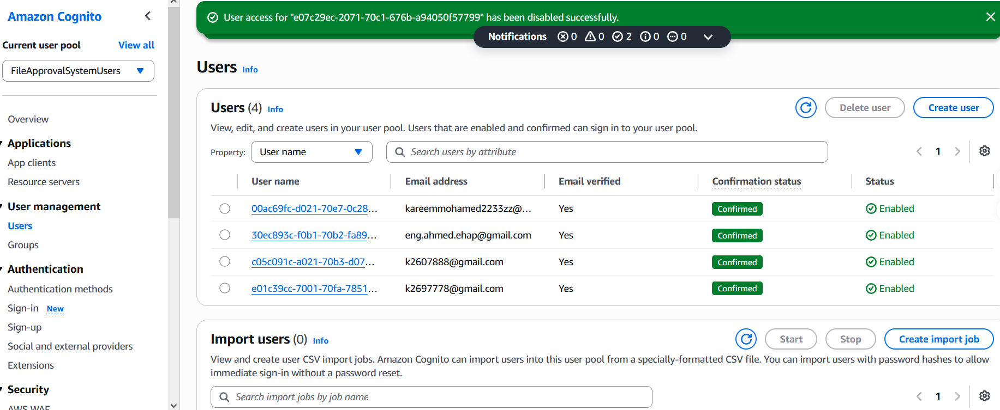

---

# Step 7 — Create DynamoDB Table

Create a DynamoDB table:

```text
FileMetadata
```

### Primary Key

```text
Partition Key:
fileId

Type:
String
```

No sort key is required for this prototype.

### Capacity

```text
On-Demand
```

### Example Item

```json
{
  "fileId": "UUID",
  "userId": "COGNITO_SUB",
  "userEmail": "user@example.com",
  "fileName": "report.pdf",
  "fileType": "application/pdf",
  "fileSize": 123456,
  "s3Key": "pending/user-id/file-id/report.pdf",
  "uploadDate": "2026-09-13T00:00:00Z",
  "status": "PENDING"
}
```

Possible statuses:

```text
PENDING
APPROVED
REJECTED
```

### 📸 Screenshot

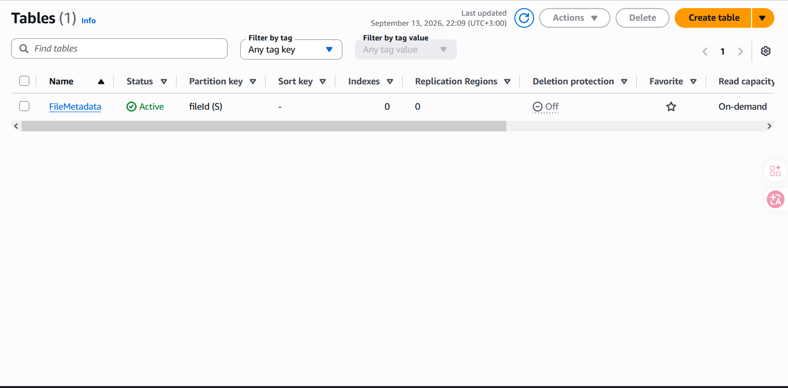

---

# Step 8 — Create SNS Topic

Create an SNS topic:

```text
FileApprovalNotifications
```

The topic is used to notify the administrator when a new file has been uploaded.

### Workflow

```text
Lambda
   │
   ▼
SNS Topic
   │
   ▼
Admin Email
```

The email subscription must be confirmed.

### 📸 Screenshot

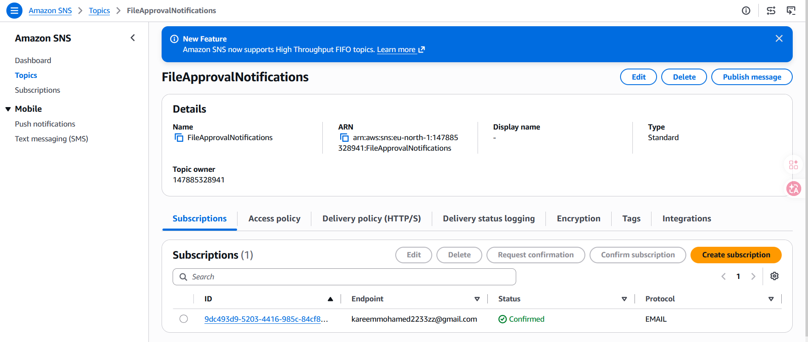

---

# Step 9 — Create IAM Role for Lambda

Create an IAM role:

```text
FileApprovalLambdaRole
```

The role follows the principle of **least privilege**.

### CloudWatch Logs

```text
logs:CreateLogGroup
logs:CreateLogStream
logs:PutLogEvents
```

### DynamoDB

```text
dynamodb:GetItem
dynamodb:PutItem
dynamodb:UpdateItem
dynamodb:Scan
```

### S3

```text
s3:GetObject
s3:PutObject
s3:DeleteObject
s3:ListBucket
```

### SNS

```text
sns:Publish
```

The permissions are restricted to the required resources.

### 📸 Screenshot

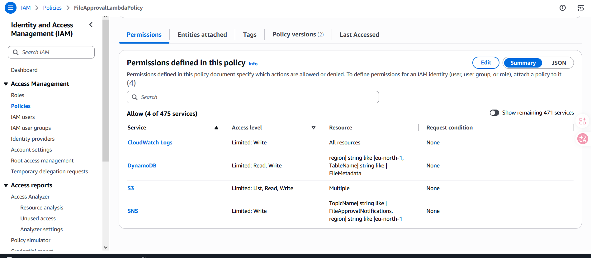

---

# Step 10 — Create Lambda Function

Create a Lambda function:

```text
file_management
```

### Runtime

```text
Python 3.12
```

### Execution Role

```text
FileApprovalLambdaRole
```

The Lambda function is responsible for:

- Authentication checks
- Admin authorization
- Generating Presigned URLs
- Reading and writing DynamoDB metadata
- Managing S3 files
- Sending SNS notifications
- Approving files
- Rejecting files

### 📸 Screenshot

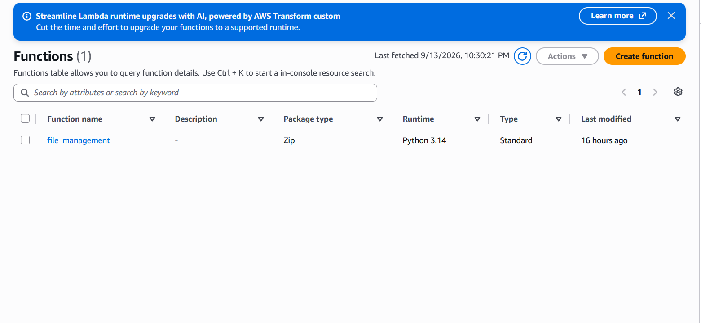

---

# Step 11 — Configure Lambda Environment Variables

The Lambda function uses environment variables instead of hardcoding resource names.

```text
BUCKET_NAME=YOUR_FILE_BUCKET

TABLE_NAME=FileMetadata

SNS_TOPIC_ARN=YOUR_SNS_TOPIC_ARN

PENDING_PREFIX=pending/

APPROVED_PREFIX=approved/
```

This makes the application easier to configure and maintain.

### 📸 Screenshot

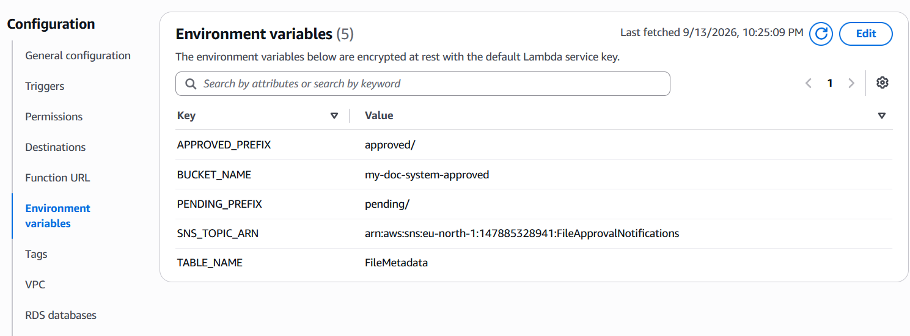

---

# Step 12 — Upload Management Logic

The upload process is divided into two API operations.

## 12.1 Initiate Upload

The frontend sends:

```text
POST /upload/initiate
```

with:

```json
{
  "fileName": "report.pdf",
  "contentType": "application/pdf"
}
```

Lambda generates a unique:

```text
fileId
```

and creates a Presigned S3 PUT URL.

---

## 12.2 Direct Upload to S3

The browser uploads the file directly to S3:

```text
Browser
   │
   │ PUT file
   ▼
S3
```

This prevents large files from unnecessarily passing through API Gateway and Lambda.

---

## 12.3 Complete Upload

After the S3 upload succeeds:

```text
POST /upload/complete
```

The Lambda function:

1. Finds the uploaded object
2. Gets the file metadata
3. Creates the DynamoDB item
4. Sets status to `PENDING`
5. Sends SNS notification to the administrator

### Upload Flow

```text
User
 │
 ▼
API Gateway
 │
 ▼
Lambda
 │
 └── Generate Presigned URL
          │
          ▼
        User
          │
          │ PUT
          ▼
         S3
          │
          ▼
API Gateway
 │
 ▼
Lambda
 │
 ├── DynamoDB
 │      PENDING
 │
 └── SNS
        │
        ▼
    Admin Email
```

---

# Step 13 — Create API Gateway REST API

Create:

```text
FileApprovalAPI
```

### API Type

```text
REST API
```

### Endpoint Type

```text
Regional
```

### 📸 Screenshot

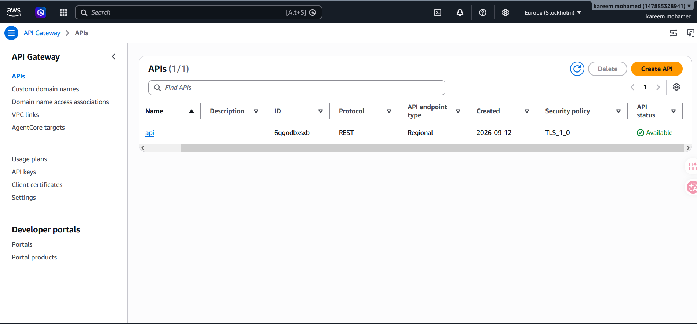

---

# Step 14 — Create API Resources

The API contains the following resources:

```text
/
├── upload
│   ├── initiate
│   │   └── POST
│   │
│   └── complete
│       └── POST
│
└── admin
    └── files
        ├── GET
        │
        └── {fileId}
            ├── approve
            │   └── POST
            │
            └── reject
                └── POST
```

---

# Step 15 — Configure Lambda Proxy Integration

All API Gateway methods use:

```text
Integration Type:
Lambda Function
```

and:

```text
Use Lambda Proxy Integration:
Enabled
```

This allows Lambda to directly receive:

```text
httpMethod
resource
pathParameters
requestContext
authorizer
body
```

---

# Step 16 — Create Cognito Authorizer

Create an API Gateway Cognito authorizer:

```text
CognitoAuthorizer
```

### Configuration

```text
Type:
Cognito

User Pool:
FileApprovalSystemUsers

Token Source:
Authorization
```

The frontend sends:

```text
Authorization: Bearer JWT
```

API Gateway validates the JWT before invoking Lambda.

# Step 17 — Protect API Routes

The Cognito authorizer is attached to all protected endpoints.

```text
POST /upload/initiate
POST /upload/complete

GET /admin/files

POST /admin/files/{fileId}/approve
POST /admin/files/{fileId}/reject
```

The API is therefore protected by authentication.

---

# Step 18 — Admin Authorization

Authentication alone is not enough.

The Lambda function also checks the user's Cognito group:

```text
cognito:groups
```

Only:

```text
Admins
```

can execute administrative operations.

### Authorization Flow

```text
JWT
 │
 ▼
API Gateway
 │
 │ Cognito Authorizer
 ▼
Lambda
 │
 │ Check cognito:groups
 ▼
┌─────────────────────────────┐
│ Is user member of Admins?   │
└─────────────┬───────────────┘
              │
       ┌──────┴──────┐
       │             │
      YES            NO
       │             │
       ▼             ▼
 Admin Operation    403
```

This prevents a normal user from becoming an administrator simply by changing the frontend.

---

# Step 19 — Configure CORS

CORS is configured to allow the frontend to communicate with API Gateway.

During development:

```text
Access-Control-Allow-Origin: *
```

For production, this should be restricted to the CloudFront domain:

```text
https://YOUR-CLOUDFRONT-DOMAIN
```

Example:

```text
https://dxxxxxxxxxxxx.cloudfront.net
```

### 📸 Screenshot

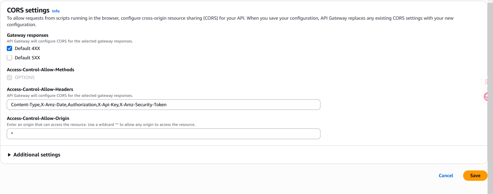

---

# Step 20 — Deploy API Gateway

Create a deployment stage:

```text
prod
```

The API base URL becomes:

```text
https://YOUR_API_ID.execute-api.YOUR_REGION.amazonaws.com/prod
```

Endpoints:

```text
POST /prod/upload/initiate

POST /prod/upload/complete

GET /prod/admin/files

POST /prod/admin/files/{fileId}/approve

POST /prod/admin/files/{fileId}/reject
```

---

# Step 21 — Configure Frontend

The frontend uses:

```javascript
const CONFIG = {
  USER_POOL_ID: "YOUR_USER_POOL_ID",
  CLIENT_ID: "YOUR_APP_CLIENT_ID",
  API_BASE_URL: "YOUR_API_GATEWAY_URL",
  AWS_REGION: "YOUR_AWS_REGION",
};
```

These values connect the frontend to:

```text
Cognito
API Gateway
AWS Region
```

---

# Step 22 — User Authentication

The registration process:

```text
User
 │
 ▼
register.html
 │
 ▼
Cognito
 │
 ├── Create Account
 │
 └── Email Confirmation
```

After confirmation, the user can log in.

### 📸 Screenshot

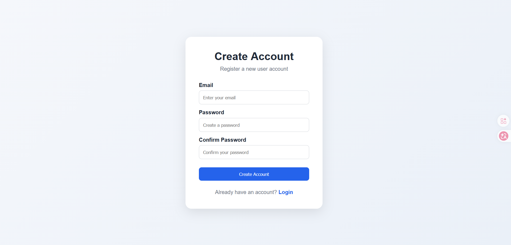

---

# Step 23 — User Login

The login process is:

```text
User
 │
 ▼
login.html
 │
 ▼
Cognito
 │
 ▼
JWT Tokens
 │
 ▼
Frontend
```

The application checks the user's Cognito group.

```text
Admins → admin.html

Users → user.html
```

### 📸 Screenshot

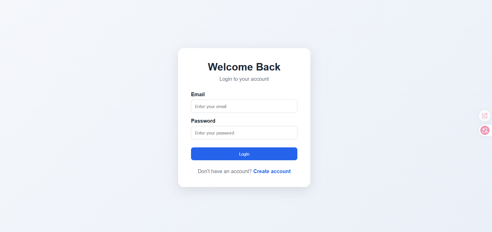

---

# Step 24 — User Dashboard

The normal user dashboard provides:

- User email
- File selection
- Upload button
- Upload progress
- Upload status
- Logout

### 📸 Screenshot


---

# Step 25 — Upload a File

The complete upload flow is:

```text
1. User selects file

2. Frontend → API Gateway
   POST /upload/initiate

3. API Gateway → Lambda

4. Lambda generates Presigned URL

5. Lambda → Frontend

6. Frontend → S3
   PUT file

7. Frontend → API Gateway
   POST /upload/complete

8. Lambda → DynamoDB
   status = PENDING

9. Lambda → SNS

10. SNS → Admin Email
```

---

# Step 26 — Pending S3 Storage

After uploading:

```text
S3 File Bucket
│
└── pending/
    └── userId/
        └── fileId/
            └── filename
```

The file remains private.

### 📸 Screenshot

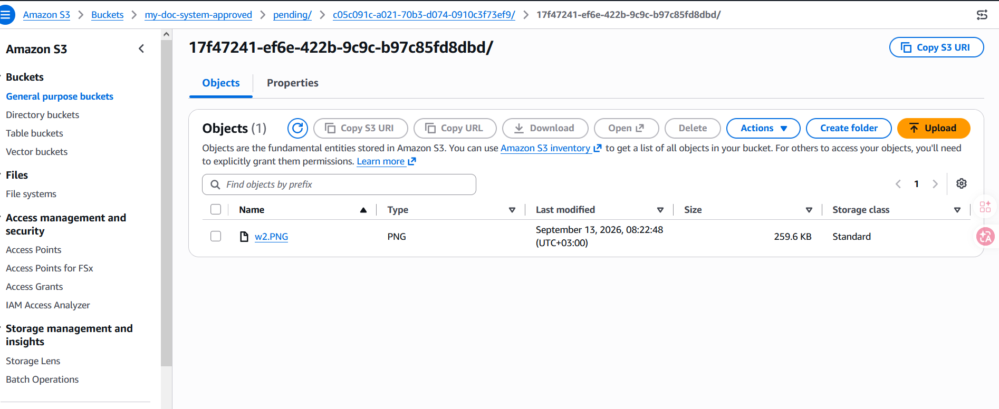

---

# Step 27 — DynamoDB PENDING Record

After upload completion, DynamoDB stores the metadata.

```text
status = PENDING
```

Example:

```json
{
  "fileId": "123456",
  "userId": "abc123",
  "userEmail": "user@example.com",
  "fileName": "report.pdf",
  "fileType": "application/pdf",
  "fileSize": 123456,
  "s3Key": "pending/abc123/123456/report.pdf",
  "status": "PENDING"
}
```

### 📸 Screenshot

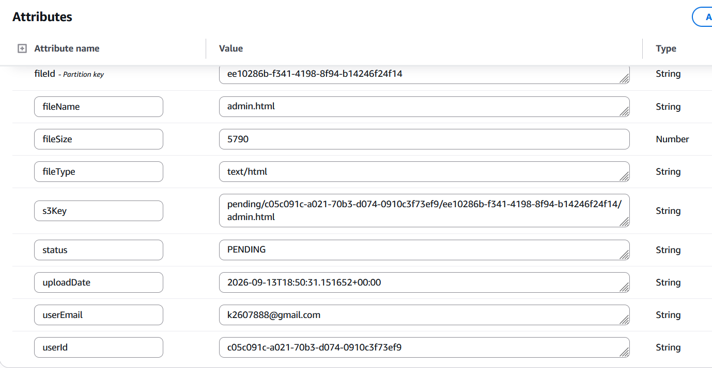

---

# Step 28 — Admin Notification

After the file becomes `PENDING`:

```text
Lambda
  │
  ▼
SNS
  │
  ▼
Admin Email
```

The administrator receives a notification that a new file requires review.

### 📸 Screenshot

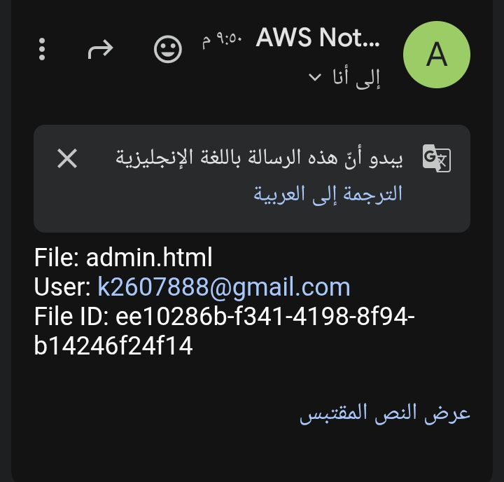

---

# Step 29 — Admin Dashboard

The administrator logs in using an account belonging to:

```text
Admins
```

The Admin Dashboard displays:

- File name
- User email
- File type
- Upload date
- Status
- Approve button
- Reject button

### 📸 Screenshot

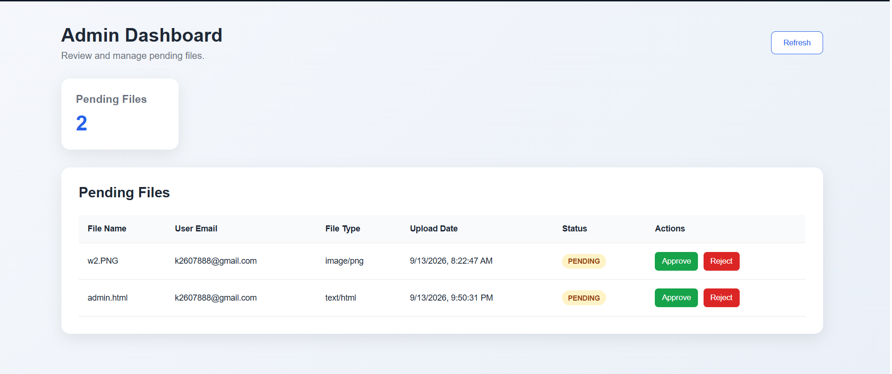

---

# Step 30 — Get Pending Files

The Admin Dashboard calls:

```text
GET /admin/files
```

The request contains:

```text
Authorization: Bearer JWT
```

API Gateway validates the token.

Lambda then verifies:

```text
Admins
```

before reading pending records from DynamoDB.

---

# Step 31 — Approve a File

When the administrator clicks:

```text
Approve
```

the frontend sends:

```text
POST /admin/files/{fileId}/approve
```

Lambda performs:

```text
1. Validate Admin
2. Get DynamoDB item
3. Verify status = PENDING
4. Copy S3 object
5. pending/ → approved/
6. Delete pending object
7. Update DynamoDB
8. status = APPROVED
9. Store approvedBy
10. Store approvedAt
```

### Approval Flow

```text
Admin
 │
 ▼
Admin Dashboard
 │
 ▼
API Gateway
 │
 ▼
Lambda
 │
 ├── DynamoDB
 │
 ├── S3 CopyObject
 │      │
 │      └── pending → approved
 │
 ├── S3 DeleteObject
 │
 └── DynamoDB Update
        │
        ▼
     APPROVED
```

### 📸 Screenshot

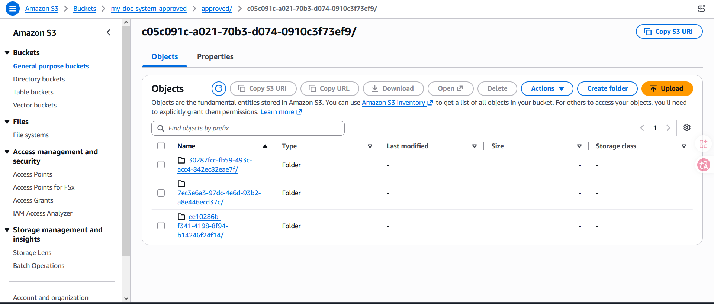

---

# Step 32 — Approved S3 Storage

After approval:

```text
S3
│
└── approved/
    └── userId/
        └── fileId/
            └── filename
```

The original pending object is deleted.

---

# Step 33 — Reject a File

When the administrator clicks:

```text
Reject
```

the frontend sends:

```text
POST /admin/files/{fileId}/reject
```

Lambda performs:

```text
1. Validate Admin
2. Get DynamoDB item
3. Verify status = PENDING
4. Delete pending S3 object
5. Update DynamoDB
6. status = REJECTED
7. Store rejectedBy
8. Store rejectedAt
```

### Reject Flow

```text
Admin
 │
 ▼
Admin Dashboard
 │
 ▼
API Gateway
 │
 ▼
Lambda
 │
 ├── Delete S3 pending object
 │
 └── Update DynamoDB
        │
        ▼
     REJECTED
```

---

# 🔒 Security Architecture

Security is one of the main components of this project.

## Authentication

Amazon Cognito provides:

```text
User Authentication
JWT Tokens
Email Verification
```

---

## Authorization

Cognito Groups provide:

```text
Users
Admins
```

Administrative operations are additionally validated inside Lambda.

---

## Private S3 Storage

The file bucket has:

```text
Block Public Access = ON
ACLs = Disabled
Encryption = Enabled
Versioning = Enabled
```

Files are not publicly accessible.

---

## Presigned URLs

Users do not receive permanent S3 credentials.

Instead, Lambda generates a temporary:

```text
Presigned PUT URL
```

with a limited lifetime.

This allows the browser to upload directly to S3 without exposing AWS credentials.

---

## IAM Least Privilege

Lambda uses a dedicated IAM role with only the permissions required to:

```text
Read/Write DynamoDB
Manage S3 objects
Publish SNS notifications
Write CloudWatch logs
```

---

## API Authentication

API Gateway uses:

```text
Cognito Authorizer
```

to validate JWT tokens before allowing protected API requests.

---

# 📊 Complete Data Flow

```text
                    USER
                     │
                     ▼
                CloudFront
                     │
                     ▼
               S3 Frontend
                     │
          ┌──────────┴──────────┐
          │                     │
          ▼                     ▼
       Cognito              API Gateway
          │                     │
          │ JWT                 │
          └──────────►──────────┘
                                │
                                ▼
                              Lambda
                                │
                ┌───────────────┼───────────────┐
                │               │               │
                ▼               ▼               ▼
               S3           DynamoDB           SNS
                │               │               │
                │               │               ▼
                │               │          Admin Email
                │               │
                │               ▼
                │          File Status
                │
                ├── pending/
                │
                └── approved/
```

---

# 📂 S3 Security Model

There are two separate buckets:

```text
┌──────────────────────────┐
│ S3 Frontend Bucket       │
│                          │
│ HTML / CSS / JS          │
│ Private                  │
│ CloudFront OAC           │
└──────────────────────────┘


┌──────────────────────────┐
│ S3 File Storage Bucket   │
│                          │
│ pending/                 │
│ approved/                │
│                          │
│ Private                  │
│ Encryption               │
│ Versioning               │
└──────────────────────────┘
```

---

# 🧩 Why Serverless?

This project intentionally avoids EC2.

Instead, it uses managed services:

```text
S3
Lambda
API Gateway
DynamoDB
Cognito
SNS
CloudFront
```

Advantages:

- No server management
- Automatic scaling
- Pay-per-use model
- Reduced infrastructure maintenance
- High availability
- Easier deployment
- Smaller attack surface

---

# 💡 Key Technical Concepts Demonstrated

This project demonstrates practical experience with:

### AWS

- Amazon S3
- Amazon CloudFront
- Amazon Cognito
- API Gateway
- AWS Lambda
- DynamoDB
- SNS
- IAM
- CloudWatch

### Security

- JWT Authentication
- Role-Based Access Control
- Cognito Groups
- Least Privilege IAM
- Private S3 Buckets
- Presigned URLs
- HTTPS
- Origin Access Control
- API Authorization
- Serverless Security

### Backend

- Python
- Boto3
- REST APIs
- Lambda Proxy Integration
- DynamoDB operations
- S3 operations

### Frontend

- HTML
- CSS
- JavaScript
- Fetch API
- XMLHttpRequest
- JWT handling
- Progress tracking

---

# 🛡️ Security Best Practices Implemented

| Security Control | Implementation            |
| ---------------- | ------------------------- |
| Authentication   | Amazon Cognito            |
| Authorization    | Cognito Groups + Lambda   |
| API Protection   | Cognito Authorizer        |
| File Storage     | Private S3                |
| File Upload      | Presigned URL             |
| Encryption       | S3 Server-Side Encryption |
| Access Control   | IAM Least Privilege       |
| HTTPS            | CloudFront                |
| CDN Security     | CloudFront OAC            |
| Logging          | CloudWatch                |
| Public S3 Access | Blocked                   |

---

# 🔄 Complete Approval Workflow

```text
                   USER
                     │
                     ▼
               Select File
                     │
                     ▼
            POST /upload/initiate
                     │
                     ▼
                  Lambda
                     │
                     ▼
           Generate Presigned URL
                     │
                     ▼
                  Browser
                     │
                     │ PUT
                     ▼
                  S3
                     │
                     ▼
              pending/file
                     │
                     ▼
            POST /upload/complete
                     │
                     ▼
                  Lambda
                     │
             ┌───────┴────────┐
             ▼                ▼
         DynamoDB            SNS
         PENDING              │
             │                ▼
             │           Admin Email
             ▼
        Admin Dashboard
             │
       ┌─────┴─────┐
       │           │
       ▼           ▼
    APPROVE      REJECT
       │           │
       ▼           ▼
      S3          S3
 pending →      Delete
 approved
       │           │
       ▼           ▼
   DynamoDB     DynamoDB
   APPROVED     REJECTED
```

---

# 🚀 Future Improvements

The following improvements can be added in future versions:

- [ ] Amazon SES for user-specific approval/rejection emails
- [ ] Malware scanning before approval
- [ ] File type allowlist
- [ ] Backend file-size validation
- [ ] DynamoDB GSI for `status`
- [ ] API Gateway throttling
- [ ] API request validation
- [ ] CloudWatch alarms
- [ ] CloudTrail auditing
- [ ] AWS WAF for CloudFront
- [ ] AWS KMS customer-managed encryption keys
- [ ] File download using secure Presigned GET URLs
- [ ] User file history
- [ ] Admin audit log
- [ ] Pagination for large file lists
- [ ] Infrastructure as Code using Terraform or AWS CloudFormation
- [ ] CI/CD using GitHub Actions

---

# 📚 Project Learning Outcomes

Through this project, I practiced designing and implementing a complete serverless AWS application with a focus on security.

The project helped me understand how multiple AWS services can work together to create a secure and scalable cloud application.

The most important concepts I practiced were:

```text
Authentication
       ↓
Authorization
       ↓
REST API
       ↓
Serverless Compute
       ↓
Secure File Upload
       ↓
Object Storage
       ↓
Metadata Management
       ↓
Admin Approval Workflow
       ↓
Monitoring
```

---

# 👨‍💻 Author

**Kareem Mohamed**

Cybersecurity Student | AWS Cloud Security

Focused on:

```text
AWS
Cloud Security
Cybersecurity
Networking
Python
Linux
```

---

# ⭐ Project Highlights

```text
🔐 Secure Authentication
👥 Role-Based Authorization
☁️ Serverless Architecture
📤 Presigned S3 Uploads
🗂️ Private File Storage
🧑‍💼 Admin Approval Workflow
📊 DynamoDB Metadata
📧 SNS Notifications
🌐 CloudFront HTTPS
🔑 IAM Least Privilege
📈 CloudWatch Monitoring
```

---

## ⭐ If you found this project useful

Feel free to explore the repository and learn from the implementation.

**Star ⭐ the repository if you find it useful.**
